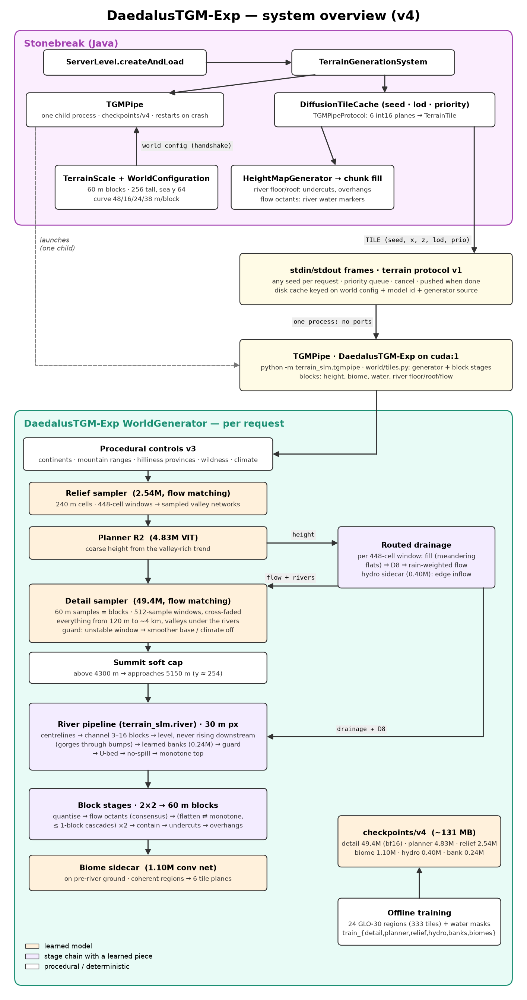

# DaedalusTGM-Exp: Terrain Generation Model Architecture

**Branch:** `Project-Daedalus` (off Project-Heracles) · **As of:** 2026-09-28 (v4: 49M detail sampler, 24 regions, routed drainage + downhill-only rivers, hilly lowlands, biome sidecar; §1a)
**Name:** **DaedalusTGM-Exp** (Daedalus Terrain Generation Model, experimental): the official name of the model (the process that serves it to the game is **TGMPipe**). Code identifiers keep their original names: Python package `terrain_slm`. The name appears in `terrain_slm.MODEL_NAME`, the service's READY handshake (`"name"`), its `model_id` (`DaedalusTGM-Exp/v3:p…:r…:l…:h…:b…:g…`), its log, and `TGMPipe.MODEL_NAME` (Java)
**Home:** `Models/DaedalusTGM-Exp/` (this model: code, training, TGMPipe, checkpoints, reports, docs) · Java `TGMPipe` + world constants (`TerrainScale`)
**Plan / history:** [`Terrain-SLM-Plan.md`](Terrain-SLM-Plan.md) (§13 onward is the running log)

---

## 1. Status at a glance

| | |
|---|---|
| Default generator | **DaedalusTGM-Exp v4** (`TGMPipe.DEFAULT_MODEL`, model dir `checkpoints/v4`, ~131 MB: `detail.pt` 99 MB bf16 — LFS decision pending). v3 kept in `checkpoints/v3`. **§1a describes v4; the rows below are v3 unless marked** |
| **v4 additions** | detail sampler 49.4M (replaces synth + refiner + MaskGIT for heights), planner R2 4.83M, relief wide 2.54M, hydro/bank retrained on 24 regions, routed drainage, biome sidecar 1.10M (§1a, §1b) |
| Controls | **v2**: continents + long, winding **mountain ranges** (spines, spurs, foothills) + climate archetypes (§6) |
| Relief sampler | **new**: flow-matching conv UNet on 240 m cells, **425,033 params**, 11 min; samples valley networks onto the smooth trend (§7) |
| Planner (the "SLM") | **R1**: ViT d176 × 4 layers × 4 heads, **1,558,656 params** (unchanged; now fed a valley-rich trend) |
| Refiner | conditional flow-matching conv UNet, **336,785 params** (unchanged) |
| Descriptor sampler | **new in v3**: MaskGIT over split-codebook tokens, **1,552,248 params**, 20 min; replaces the planner's averaged descriptors (§9a) |
| Hydrology sidecar | **new in v3**: conv UNet on 240 m cells, **400,051 params**, 8 min; drainage, rivers and D8 flow from the final coarse height (§11a) |
| Bank model | **new in v3**: conv UNet on 30 m pixels, **236,497 params**, 6 min; real river banks, run only where a river exists (§11c) |
| Training data | 7 Copernicus GLO-30 regions, 134 one-degree tiles (§4) |
| World | **256 tall, sea level y 64**, 60 m blocks, **vertically exaggerated** height curve: 2 km → y 170, 3 km → y 197, 4 km → y 223 (§3) |
| Water | rivers from the hydro sidecar through the river pipeline (§11): 3–16 blocks wide, 2–6 deep, learned banks, undercuts and overhangs in the game's 3D tunnel planes, flow octants; no lakes; threshold 5.5 |
| Mountains (seed 2, 61 km square) | seeds 0–3: peaks y 230–232 (highest real-Alps window: 237), 144–164 blocks of relief (real: 154), p99 block step 2 (real: 3); report `reports/v3/` (v3 keeps these; see §14) |

---

## 1a. v4 (2026-09-28): detail sampler, 24 regions, rivers that flow downhill

v4 targets three complaints about v3 worlds: **lowlands were flat**, **rivers climbed and dipped along their
course and flipped direction**, and **there were far too many rivers**.

### What changed

| Piece | v3 | v4 |
|---|---|---|
| Training data | 7 regions, 134 tiles | **24 regions, 333 tiles with data (335 in the boxes)**: + hilly lowlands (Appalachian Plateau, Ozarks, Loess Plateau, Mar de Morros, Rhenish Massif, Massif Central, Tuscany, Scottish Highlands, Carpathian hills) and more mountain types (Ethiopian Highlands, Drakensberg, Zagros, Colorado Rockies, central Andes, Karakoram, NZ Southern Alps, Japan Chubu) |
| Detail below a cell | synth (descriptor noise) + refiner SDEdit, 337k params, ~1 km receptive field | **detail sampler** (`models/detail.py`): flow-matching UNet on **60 m samples = blocks**, 49.4M params, ~24 km receptive field |
| Descriptors | MaskGIT sampler | not needed by the detail sampler (`descgit.pt` is not shipped in v4) |
| Planner | R1, 1.56M, 7 regions | **R2** (d256 × 6), 4.83M, 24 regions: val height MAE **31 m vs R1's 97 m** on the 24-region val set, river IoU 0.38 vs 0.18 |
| Relief sampler | 425k | **wide** (32/64/96/128 ch), 2.54M, 24 regions; won the end-to-end mountain A/B |
| Drainage | hydro sidecar's regression | **routed**: fill → D8 → precipitation-weighted accumulation on the final coarse height, per canonical hydro window; the sidecar only supplies inflow at window edges |
| River levels | ground under the centreline, smoothed | **never rise downstream** (three stages, below) and never drop more than one block per column |
| River threshold | 5.5 (hydro) | **7.5** on routed drainage (`RIVER_THRESHOLD_ROUTED`; 2 log units = ~7x the drainage area before a river starts) |
| Lowland controls | every lowland at plains relief | **hilliness provinces** (plains / rolling / hill country) calibrated on real hilly regions; spawn at least rolling |

### Detail sampler (`models/detail.py`, `train/train_detail.py`)

| | |
|---|---|
| Resolution | 60 m samples, the game's block size: nothing it draws is averaged away by the 2x2 block mean |
| Target | `asinh((dem60 - base60) / 10 m)`, `base60 = detail_base(coarse cells)` (bilinear x4 + 6-sample blur). The asinh holds a 2 m plains ripple and a 1 km Alpine valley in one range with no scale field, so the model decides how hilly ground is from its conditioning |
| Conditioning (22 ch) | base height + slope, 8 descriptors (dropout 0.4; off in game), wildness, 4 climate, log flow + river (dropout 0.3), 4 presence flags. Drainage conditioning is what makes valleys form under the rivers |
| Model | UNet 96/192/288/384/512, 2 ResBlocks per level + 4 mid, FiLM time, dropout 0.1, zero-init output, no norm layers, 1x1 skip merges. **49,351,745 params** |
| Training | 256x256-sample crops (15 km), coarse degraded like planner output (blur 0.5-2 cells + <= 20 m low-frequency jitter), 8 dihedral transforms, regions sampled uniformly; logit-normal t, AdamW 2e-4 (wd 0.01), cosine to 10%, EMA 0.9995, bf16, `torch.compile`; batch 32, **80k steps, ~5.5 h on one RTX PRO 6000 at 450 W** (232-260 ms/step, 31 GB) |
| In game | canonical **512-sample windows around 256-sample cores (one tile)**, cross-faded; coordinate-hashed noise (stream 12289); 16 Euler steps; each sample covers 2x2 native pixels (nearest), so the tile builder's block mean returns the model's samples exactly. Overlaps agree at correlation 1.000 (no variance lost to the fade); request-independent to 0.0 m |

**Instability trap (fixed).** Early in-game scans blew up (x → inf) on 13-17% of windows while validation looked perfect.
The in-game base came from *unblurred* planner cells, which keep a faint 4-cell (16-sample) patch texture; training
always blurred the coarse field. The texture lines up with the UNet's stride-16 mid level and drives it unstable. The
generator now blurs planner cells by `DETAIL_BASE_BLUR_CELLS` (1.5, inside training's 0.5-2 range) before the base:
0 of 288 windows over 8 seeds fail. A guard stays in place: a non-finite or implausible window (|x| >= 7, ~5.5 km) is
resampled from a smoother base (`DETAIL_BASE_BLUR_RETRY`), logged as `[detail] WARNING`, and falls back to the smooth
base rather than ever shipping garbage. **Re-scan any new detail checkpoint before shipping it** (many
`_detail_window`s over several seeds; count failures and the largest detail relief).

### Rivers (§11 changes)

- **Routed drainage** (`generator.routed_drainage`): accumulation grows downstream by construction, so rivers form one
  connected, branching network instead of fragments that start and stop where regressed flow wobbled around the
  threshold. Routing runs over the height plus 3 m of smooth hashed noise (`ROUTE_NOISE_*`) and fills with a
  **per-cell epsilon** (`fill_depressions(epsilon_field=...)`), so paths across plains and filled basins meander
  instead of running as straight canals. ~50 ms per 448-cell window.
- **Water never rises downstream**, at three levels: `monotone_downstream` in `WaterSurface` (along the connected
  centreline, ordered by flow; a bump across the river's path is cut as a gorge, `extra_incision_blocks` 20), the
  new `MonotoneTop` after `NoSpill`, and the new block stage `MonotoneBlocks` (also caps each column at its downstream
  neighbour + 1 block, so steep reaches incise into one-block cascades). `FlattenAcross` and `MonotoneBlocks` run
  twice, alternating (both only lower water, so they settle onto each other).
- **Flow octants**: water-surface gradient first (now monotone and level across each section), then the direction in
  which accumulation grows, then D8; then a 5-block vector consensus removes isolated flips. (Tried and rejected: the
  accumulation ridge's Hessian axis, which flips on the ridge flanks: 6-8% reversals.)
- `pipeline.HALO_PX` 128 → 256 to keep the new relaxations request-independent.

### Lowland controls (§6 changes)

`hilly` = a 350-cell (~84 km) province field (`HILL_*`): hills-noise amplitude 100 → 360 m and band-3 roughness
+0.55 from plains to hill country, softened (`HILL_SOFTNESS`) so rolling ground is the common middle; plains keep
gentle swells. Calibration (real): hilly lowlands have 5-18 m band-3 roughness and 26-116 m relief at 5-25 km; Great
Plains / Sahara 2-3 m and 7-15 m. World-wide lowland: ~31% plains, ~35% hilly. `HILL_HOME_MIN` 0.55 keeps spawn at
least rolling (0 disables).

### Measured (`eval/world_report.py`, 768-block squares at spawn; `eval/mountains.py`)

Shipped: `checkpoints/v4` (detail sampler = EMA at **step 66,000** of `detail_r0`; see below). v3 = committed HEAD code
and weights, same squares and seeds.

| Metric | v3 | v4 |
|---|---|---|
| Lowland local relief (std, blocks), seeds 0-5 | 0.43-0.64 | **1.6-2.5** |
| Lowland spanning >= 8 blocks within 16 | 0-1% | **38-73%** |
| Land under river water | 0.02-7.3% | 0.4-2.3% |
| Water climbing downstream (per downstream wet pair) | 0.2-3.9% | **0** |
| Direction turns > 90 deg / reversals | 2.7-5.1% / 0-1.3% | 0.6-1.5% / 0.2-0.8% |
| Leaking river water blocks (full-column check, 6 seeds) | leaked at river mouths | **0** |
| River steps > 1 block | (not measured) | **0** |
| Peak (mountain report, seeds 0-3) | y 231-232 | **y 243-246** |
| Relief, 61 km square | 147-165 blocks | **173-185** |
| Steep steps (>= 3 blocks; real Alps 5.8%) | 0.2-0.6% | 0.2-6.2% |
| Band RMS vs real Alps, 0.5-2 km bands | 0.32-0.75 | **0.52-1.03** |
| Band RMS vs real Alps, finest (~100 m) band | 0.57-0.75 | 0.46-0.65 (softer summits) |
| Tile time (GPU 1 at 150 W) | ~1.85 s, cold 17 s | ~2.0 s, cold 22 s |
| Detail-window stability (288 windows, 8 seeds) | n/a | 3 guard retries, 0 fallbacks |

**Why step 66k, not 80k.** Validation is flat from ~38k (val FM 0.328 -> 0.3206 at 66k -> 0.3194 at 80k; amplitude 0.935
vs 0.928), but in-game stability is not: 80k needed 13-16 guard retries and 1-5 fallbacks per 288 windows. The trigger
is the barely-trained t ~ 0 regime on tropical-archetype windows (low seasonality + high rain) over in-game terrain. A
later sampler start (0.05) fixes it but costs amplitude (per-crop median 0.94 -> 0.71), and a 12k-step fine-tune with
early-t coverage (`train_detail --t-uniform/--t-early`) did not fix the hard windows. **Next run:** normalisation (or
bounded FiLM) in the mid blocks, in-game-style conditioning (planner coarse + archetype climate) as augmentation, and
early-t coverage from the start.

### 1b. Biome sidecar (`models/biomenet.py`, `train/train_biomes.py`) — v4

The rule classifier (`biomes._classify_biome`) decides each column alone from elevation, its own slope (vegetation
thresholds at slope ratio >= 0.62) and climate. On v4's hills, 1-2 block steps straddle those thresholds column by
column: speckle, small blobs and streaks (v4 rule: 415-739 specks < 20 columns per 46 km square). The sidecar learns the
same classification with coherent regions.

| | |
|---|---|
| Model | 3-level conv UNet 48/96/128, **1,103,155 params**, receptive-field radius <= 23 blocks (< `BLOCK_MARGIN` 24: request-independent; `test_biomenet_receptive_field_fits_inside_the_tile_margin`) |
| Inputs (10 ch) | elevation quantised exactly as `TileBuilder` does (blocks -> mid-block metres), slope, 4 lapse-adjusted climate channels, the rule classifier's own 3 coordinate-noise fields (so edges keep their wiggle), land flag |
| Targets | rule classifier on real terrain (24 regions, 12k crops of 160^2 blocks), cleaned by 9x9 then 5x5 majority filters |
| Climate augmentation | half the crops get shifted climate (T +-8 C, rain x0.3-3, seasonality/variability scaled): in game archetype climate lands on any terrain, and without this, warm lowland swamp (absent from the real regions) vanished (18.6% -> 0.2% on seed 1) |
| Training | class-balanced CE (1/sqrt(freq), clipped), AdamW 1e-3, grad clip 1, 30k steps, bf16, ~14 min. lr 2e-3 without clipping diverged at the wider size |
| Held-out | 97.0% agreement with cleaned targets; every biome's share within ~0.1 pt of the rule's (swamp 2.79/2.80%, jungle 5.77/5.74%, desert 3.47/3.44%); specks per 160^2 crop 153 (rule) -> 8.6 (cleaned: 2) |
| In game (46 km, seeds 1/2) | specks 739 -> **102** and 415 -> **9**; boundary share 3.2 -> 1.7% and 1.3 -> 0.9%; biome shares preserved |
| Wiring | optional `biome.pt` in the model dir (`gen.biomenet`); `TileBuilder._blocks` classifies tile + margin on the **pre-river ground** (quantised like training; carved channels and raised banks drew ribbons: seed-1 specks 228 -> 102), noise coordinates aligned to the rule's, then crops. Request-independent (`test_v4_tile_with_detail_sampler_and_biome_sidecar_matches_a_bigger_request`). Far-zoom overview tiles keep the rule classifier |
| Known gap | faint traces of biome ribbons along a few river channels remain |
| Regional lapse (2026-09-28, after in-game review) | biome climate is lapse-adjusted by the **regional** elevation (`generator.regional_elevation`: planner cells blurred `LAPSE_REGIONAL_SIGMA_CELLS` 6, ~1.4 km), not each column's own height. With per-column lapse the classifier's hard temperature/aridity thresholds made biome boundaries trace every hill's contours: desert rings around forested hilltops, white bands along hillsides (seed 0: desert median 18 m *below* its surroundings, grove 13 m above). Boundary share 0.86% -> 0.62% on seed 0, biome shares within 0.3 pt, summit snow unchanged (92% cold biomes above y 200; peaks use elevation directly). Also used by far-zoom overview tiles. `tiles.REGIONAL_LAPSE` switches it. Remaining: parallel bands where a smooth climate gradient crosses successive thresholds (desert -> savanna -> sparse forest -> grove) — inherent to the rule classifier |

---

## 2. System overview



(`system-overview.py` regenerates it; from `docs/`: `../.venv/bin/python system-overview.py`.)

**Tile contract (unchanged for the game):** 256×256 int16 block heights + int16 biome ids + int16 water levels (`-1` = dry).

Per request, the model server runs (the v3 list below; **v4**, pictured above, replaces steps 4, 6 and 7 with the
detail sampler, computes drainage by routing instead of step 5's regression, and adds the biome sidecar
after the block stages — §1a, §1b):

1. **Procedural controls** (per 240 m cell): trend, wildness, climate.
2. **Relief sampler**: adds valley networks to the smooth trend. Canonical 448-cell windows, cross-faded.
3. **Planner**: turns the valley-rich trend into coarse height (its descriptors and drainage are superseded below).
4. **Descriptor sampler (MaskGIT)**: samples 8 terrain descriptors per cell, checkerboard windows.
5. **Hydrology sidecar**: drainage, river probability and D8 directions from the coarse height, 448-cell windows.
6. **Synth**: descriptor-driven noise at 30 m pixels.
7. **Refiner**: SDEdit at t = 0.6.
8. **Summit soft cap**, then the **river pipeline** (§11): centrelines, channel, water level, learned banks, bed, containment.
9. **Block stages** (2×2 downscale): quantise, flow, flatten, contain, undercuts, overhangs → heights, water and the 3D river planes.

---

## 3. Scale: tall mountains in a 256-block world

### What Minecraft does
Minecraft (1.18+) uses 1 m blocks, sea level y 63 and a build limit of y 320. Its mountain peaks usually top out around y 200–260, which is 150–200 m above the sea. A range spans a few hundred to a couple of thousand blocks. Measured against real terrain, that is roughly 15–20 m of reality per block on both axes, with the vertical exaggerated a further ~2–3× (jagged peaks climb 2–3 blocks per block).

### What we do
Blocks are 60 m horizontally: the model's 30 m pixels are averaged 2×2 (`TerrainScale.DOWNSCALE`). A 100 km range is therefore ~1,700 blocks long, similar to a large Minecraft range. Height is set by the `HeightCurve` (`world/height_curve.py`, knobs from the game's `TerrainScale`), using per-band metres-per-block rates (`TerrainScale.CURVE_RATES`):

| Band | Rate (m/block) | Vertical exaggeration vs 60 m horizontal |
|---|---|---|
| ocean | 48 | 1.25× |
| lowland (0–600 m) | 16 | 3.75× (keeps river incision legible) |
| midland (600–2000 m) | 24 | 2.5× |
| highland (> 2000 m) | 38 | 1.6× |

| Elevation | 0 | 600 | 1000 | 2000 | 3000 | 4000 | 4500 | 5000 |
|---|---|---|---|---|---|---|---|---|
| Block y | 64 | 100 | 124 | 170 | 197 | 223 | 236 | 250 |

The old curve (48/16/40/96, a straight 1:4 of the diffusion-era rates) put 4 km at y 174 and turned a real 35° slope into 0.44 blocks of rise per block. Under that curve, even real Alps data looked like rolling hills.

**Summit soft cap** (`generator.soft_cap_peaks`): above 4300 m, elevation approaches 5150 m (y ~254) but never reaches it. The rare summit taller than the curve allows is rounded rather than sheared flat at the build limit. It is applied in the generator, so blocks, water and biomes all see the same ground.

`TerrainScale.worldConfigJson()` sends the whole world scale (world height, sea level, horizontal m/block, downscale, tile size, curve rates and knots) in the service handshake; the service parses it strictly into a `WorldConfig` (`world/world_config.py`, which also holds `WorldConfig.GAME` for offline work) and rejects a missing or unknown key. The config is part of the disk-cache namespace.

---

## 4. Data (`terrain_slm/data/`)

| Region | Tiles | Character | t0 °C (sea-level) | Precip mm | River cells |
|---|---|---|---|---|---|
| alps | 40 | temperate high mountains, Po plain, coast | 11.6–16.8 | 659–1570 | 2.97% |
| colorado_plateau | 20 | arid canyons, mesas | 20.6–23.7 | 180–421 | 1.68% |
| sahara_erg | 12 | sand sea, dunes | 24.0–25.8 | 26–52 | 0.91% |
| borneo | 16 | tropical rainforest hills (canopy in the DSM) | 26.9–29.4 | 2660–4083 | 5.48% |
| great_plains | 15 | rolling plains, Sandhills, braided rivers | 11.5–15.3 | 511–784 | 2.77% |
| norway | 15 | boreal/alpine, fjords, glacial valleys | 5.1–8.7 | 636–3060 | 2.37% |
| east_africa | 16 | savanna, rift escarpments, volcanoes | 28.1–30.9 | 529–1098 | 3.09% |

Each region holds out one validation tile, spatially separated from its training tiles (`Region.val_tiles`). The build (`python -m terrain_slm.data.build --region <name>`) writes:
- a ~30 m square-pixel mosaic (`dem.npy`);
- per-cell fields (8×8 px) in `cells.npz`: `coarse` (cell-mean elevation), `desc` (§5), WorldClim `t0`/`tseason`/`precip`/`pcv`, precipitation-weighted D8 `acc` and `d8`.

---

## 5. Descriptor contract (`data/descriptors.py`)

| Channel | Meaning |
|---|---|
| `log_amp0..4` | log(local RMS + 0.01) of band *o*, wavelengths 2^(o+1)–2^(o+2) px (2–64 px); sharp FFT bands with raised-cosine edges |
| `ridge` | skewness of the mid band (bands 1–3): + sharp crests, − sharp valleys |
| `aniso_c`, `aniso_s` | structure-tensor coherence × cos/sin 2θ |

The same statistics are measured on real DEMs (as targets) and on synth output (in the round-trip gate). Wavelengths above 64 px belong to the coarse height.

---

## 6. Controls v2 (`world/generator.procedural_controls`)

These are stand-ins for painted maps. Every field is pointwise in cell coordinates, so any window of it is exact.

| Field | Construction |
|---|---|
| continents | 900-cell fBm + a "home continent" bump at the origin (spawn on land), smoothstep coast |
| **range field** | 2-octave fBm at `RANGE_PERIOD_CELLS` 560, domain-warped by 60 cells, normalised to unit std. Ranges run along its **zero lines**: long, winding chains ~70 km apart |
| spine / foothills | Gaussian profiles of the range field, widths 0.5 and 1.2 std |
| spurs | same construction on a 130-cell field, only inside the range body (Gaussian width 0.8 std). Out in the foothills a thin spur reads as an artificial winding wall |
| along-range height | 900-cell fBm → smoothstep (`RANGE_ALONG_BIAS` 0.2): chains rise into massifs and dip into hills over hundreds of km |
| trend | sea-level base + `along × (2800·spine + 900·spur + 500·foot)` + hills |
| wildness | roughness in [0, 1] from the same fields → band-3 log amplitude 2–40 m |
| climate | sharp softmax blend of 7 region archetypes (unchanged) |

Coverage over a 490 km square, seeds 0–3: peaks 4.3–4.4 km; 2.6–16% of land above 2000 m, 1–8% above 3000 m. The old controls peaked at ~1.3 km, because their `mountainous` mask never went above 0.54.

---

## 7. Relief sampler (`models/relief.py`, `train/train_relief.py`) — new in v2

**Why it exists.** The planner reproduces valleys that are already present in its trend input, but it cannot invent them. Measured on validation tiles, valley-scale relief (wavelengths below ~6 km) is 93 m in the real data. The planner's output depends on how smooth its input trend is:

| Trend given to the planner | Valley-scale relief out |
|---|---|
| lightly blurred (σ 3 cells) | 79 m |
| σ 8 cells | 23 m |
| σ 16 cells | 10 m |

Procedural and painted trends are smooth, so mountains came out as rough plateaus. A regression model predicts the mean of the valley layout, which is flat. A **sampler** is needed.

| | |
|---|---|
| Model | conv UNet, 4 levels (16/24/32/48 ch, 3 downsamples, receptive field ~100 cells ≈ 24 km), 2 ResBlocks per level, FiLM time conditioning, zero-init output, no norm layers, **425,033 params** |
| Target | `(blur(coarse, 2) − blur(coarse, σ)) / 250 m`, σ ~ U(8, 20) cells: the relief between what the planner expects as a trend (σ ≈ 2) and a painted-smooth one |
| Conditioning (10 ch/cell) | smooth trend (+ 12-cell-blurred jitter up to 60 m in training) and its slope (2), wildness, 4 climate channels, presence flags for wildness and climate (dropout 0.15 each) |
| Training | 144-cell crops + 40-cell margin, all 7 regions sampled uniformly, 8 dihedral transforms (planner data pipeline); flow matching, logit-normal t, EMA 0.999, AdamW 3e-4, batch 32, 30k steps, 11 min on one GPU |
| Validation | 320 held-out crops (stride 32 inside the val tiles); **amplitude ratio** std(sample)/std(real) = **0.957** (0.74 at 6k steps) (the averaging symptom is a ratio well below 1) |
| Sampling | Euler, 16 steps from coordinate-hashed white noise (stream 8191), t 0 → 1 |

**In the generator:**
- **Input trend:** the procedural trend is pre-blurred σ 4 cells, which puts it in the training distribution.
- **Windows:** canonical 448-cell windows (256-cell cores + 96-cell aprons) are cross-faded with sin² ramps. Neighbouring windows agree in their overlap at correlation **0.995–0.9997**, so the fade doesn't average relief away.
- **Oceans:** the residual is gated off below sea level (`smoothstep((trend+100)/300)`); the training regions have little deep sea.
- **No inland seas:** inland ground is floored at 30 m.
- **Fallback:** without `relief.pt` in the model directory, the generator runs the old smooth-trend pipeline.

---

## 8. Planner (`models/planner.py`)

| | |
|---|---|
| Architecture | ViT over 4×4-cell patches, axial 2D RoPE, pre-LN blocks with zero-initialised residual projections |
| Inputs (11 ch/cell) | trend (now the **relief-sampled** trend), t0, tseason, precip, pcv, river mask, wildness, 4 presence flags |
| Outputs (11 ch/cell) | coarse height, 8 descriptors, river logit, log flow accumulation |
| Training | random 64×64-cell crops, regions sampled uniformly, 8 dihedral transforms; trend degraded (blur σ 1.5–5, quantise, jitter): exactly the kind of valley-rich trend the relief sampler now provides |

| Planner | Params | Val height MAE | River IoU | Val total |
|---|---|---|---|---|
| R0 (d128×2), 7 regions | 0.44M | 38.6 m | 0.22 | 1.395 |
| **R1 (d176×4), 7 regions** | 1.56M | **34.5 m** | **0.30** | **1.307** |
| R1 without river/flow losses (ablation) | 1.56M | 38.0 m | — | desc 0.372 (R1 0.375) |

In v3 the planner's descriptors are replaced by MaskGIT samples (§9a) and its drainage by the hydro sidecar (§11a); its coarse height is still used.

## 9. Synth (`synth/noise.py`) and refiner (`models/refiner.py`)

These are unchanged in v2 and v3.
- **Synth:** hash noise, fixed band kernels, analytic amplitudes/anisotropy/ridge, 16-cell margins, so the output is region-exact.
- **Refiner:** 16→32→48 conv UNet, flow matching on the residual over the coarse surface divided by a descriptor-derived scale field, sampled as SDEdit from the synth at t 0.6 with 8 Euler steps. Lowering t_start makes terrain smoother (the refiner under-produces amplitude too), so 0.6 stays.

## 9a. Descriptor sampler: MaskGIT (`models/descgit.py`, `train/train_descgit.py`)

The planner regresses its 8 descriptors, so where the inputs cannot pin texture down it predicts the mean. v3 **samples** them instead.

| | |
|---|---|
| Tokens | split k-means codebook: 512 codes for the 5 band amplitudes plus 256 for ridge/anisotropy, 2 tokens per cell. Reconstruction error 0.11 in normalised units (one 1024-code token: 0.19) |
| Model | the planner's ViT trunk (4×4-cell patches, axial RoPE), d160 × 4, conditioned on the planner's inputs, 1,552,248 params |
| Training | planner crops; masks are either random (cosine-scheduled fraction) or tiling-like (core hidden, random neighbour cores given); cross-entropy on masked cells; 30k steps |
| Sampling | 12 passes, cosine unmasking schedule, Gumbel sampling with coordinate-hashed noise per cell, class and pass (deterministic, request-independent) |
| Tiling | 64-cell windows around 32-cell cores in a 4-phase checkerboard. A window conditions only on earlier-phase neighbours' cores, so the chain is at most 3 windows deep; hard core ownership, no cross-fade to average samples away; light 0.7-cell blur after decoding |

**Held-out result** (fine-scale variability = std of the descriptor field minus its 2-cell blur):

| Channel | Real | Planner R1 | MaskGIT |
|---|---|---|---|
| amp0 (finest) | 0.210 | 0.056 | 0.184 |
| amp1 | 0.201 | 0.053 | 0.160 |
| ridge | 0.605 | 0.052 | 0.573 |
| anisotropy | 0.45–0.48 | 0.11 | 0.44–0.46 |

The planner keeps 9–27% of real fine texture; MaskGIT restores 80–95%, with value distributions closer to real for all five amplitudes and the same large-scale fidelity (correlation with real at 8-cell scale 0.94–1.00, equal to the planner's). One flaw: the coarsest band is over-varied (0.066 vs 0.022) from codebook rounding.

**What it did not fix:** block-level relief per band is unchanged v2 → v3, and the "orange peel" look on high ground remains. MaskGIT restores how texture *varies*, but the synth still turns descriptors into isotropic noise with no drainage structure. The 1–4 km dendritic valleys need a generative model at that scale (§15).

## 10. World generator (`world/generator.py`)

| Stage | Tiling | Cache |
|---|---|---|
| relief windows | 448-cell windows, stride 256, sin² fade over 192 cells | LRU 64 |
| planner windows | 64 cells, stride 32, sin² (exact partition of unity), 1-cell blur hides the patch grid | LRU 4096 |
| hydro windows | the relief windows' layout; flow/river cross-faded, D8 by core ownership | LRU 64 |
| descriptor windows | 64-cell windows, 32-cell cores, 4-phase checkerboard, core ownership | LRU 8192 |
| pixel regions | 256 px cores + 64 px apron, cross-faded over 128 px | LRU from `--cache-size` |

`river_field(i1,j1,i2,j2)` runs native heights → summit soft cap → the river pipeline's native stages; `terrain()` returns its carved elevation plus water surface, and the server's block path runs the block stages. Optional models load when their file is in the model dir (`relief.pt`, `hydro.pt`, `bank.pt`, `descgit.pt`); without one, that stage falls back to the previous behaviour. `model_id` = `DaedalusTGM-Exp/<dir>:p<planner>:r<refiner>:l<relief>:h<hydro>:b<bank>:g<descgit>` (steps, or `none`).

## 11. River pipeline (`terrain_slm/river/`) — rebuilt in v3

Rivers are an ordered list of small stages, each with one job and a typed input and output, so any stage can be swapped or dropped by editing the list (`pipeline.default_pipeline`):

```
native pixels (30 m, metres):
  Centrelines -> ChannelGeometry -> WaterSurface -> Banks -> BankGuard -> UBed -> NoSpill
block columns (60 m, blocks):
  BlockQuantize -> FlowOctants -> FlattenAcross -> BlockContainment -> Undercuts -> Overhangs
```

| Stage | Module | What it does |
|---|---|---|
| Centrelines | `geometry.py` | Ridge lines of the smoothed drainage field (Hessian non-maximum suppression). **Hysteresis**: above the threshold is a river; down to 0.7 below it continues only if connected to a river stretch (≤ 64 px), so flow hovering at the threshold does not fragment rivers |
| ChannelGeometry | `geometry.py` | Channel sized **in blocks** from flow above the threshold: width 3 + 1.8·excess (3–16 blocks), depth 2 + 0.6·excess (2–6 blocks), whatever band of the curve it crosses |
| WaterSurface | `geometry.py` | Level = ground under the centreline, smoothed along it, carried straight across the channel (one level per cross-section), spread past the banks |
| Banks | `banks.py` | `LearnedBanks` (bank model, §11c) when `bank.pt` is present, else `LeveeBanks` (deterministic ring) |
| BankGuard | `banks.py` | Lifts only bank pixels that would let water out, and records how much (`guard_mean_lift_blocks`) |
| UBed | `geometry.py` | U-shaped bed, 1 block deep at the edge, full depth at the centre. Elevation data never records beds, so this is shaped, not learned |
| NoSpill | `contain.py` | Fixed point: water never stands above adjacent dry ground |
| BlockQuantize | `blocks.py` | Metres → blocks through the game's curve (`river/scale.py`, `BlockScale`), beds take the channel floor |
| FlowOctants | `blocks.py` | Downhill along the continuous water surface; flat reaches use the hydro sidecar's D8 |
| FlattenAcross | `blocks.py` | Each wet column takes the lowest level walking perpendicular to its flow: sideways surface steps 284 → 39 on a 30 km test square; remaining steps are one-block cascades along the flow |
| BlockContainment | `blocks.py` | A dry column beside water stands at least as high as that water |
| Undercuts | `blocks.py` | Walls ≥ 3 blocks above the water, in noise patches, get an undercut: stone lip level with the top water block, 2 air blocks above it (`riverFloor`/`riverRoof` on a dry column) |
| Overhangs | `blocks.py` | On rivers ≥ 5 blocks wide, the wet edge column beside an undercut takes the bank's lip over it: water under an overhang (a wet column with a tunnel) |

**Context and determinism:** `HALO_PX` 128 (centreline smoothing, hysteresis reach, widest channel, bank band, bank-model receptive field), `BLOCK_MARGIN` 24 blocks, no wrap-around anywhere, and the bank model runs in fp32 (bf16 rounding depended on request shape). Output is request-independent (tested).

Every stage records statistics in `ctx.stats` (guard lifts, dried pixels, block raises, flattened columns, undercuts, overhangs), and `pipeline.describe()` prints the chain (the server logs it at startup).

## 11a. Hydrology sidecar (`models/hydro.py`, `train/train_hydro.py`)

Reads the **final coarse height** (planner output) plus climate and predicts, per cell, log flow accumulation, river probability and **D8 flow direction** (9 classes). Rivers therefore follow the valleys that were actually generated; before, the planner guessed drainage from its trend input and nothing tied rivers to valleys.

| | |
|---|---|
| Model | conv UNet, 4 levels (16/24/40/56 ch), receptive field ~100 cells, 400,051 params |
| Training | planner crops (160 cells), real coarse height blurred σ 0.7–2 cells + ≤ 25 m low-frequency jitter (to look like planner output), L1 flow + BCE river + 0.25 × D8 cross-entropy, 16-cell loss margin, 20k steps |
| Held-out | river IoU **0.577** (planner: 0.30), flow L1 **0.088** (planner: 0.144), D8 accuracy **70%**. The sidecar sees real height where the planner sees a trend, so part of the gap is the input |
| Tiling | the relief sampler's 448-cell windows; flow and river cross-faded, D8 taken from the window whose core owns the cell (classes cannot be blended) |
| Threshold | 5.5 (training definition 6.08): about 1–5% of land water with 3–16-block rivers |

**Ablation: does removing the rivers from the planner free capacity?** No. R1 retrained without the river and flow losses: descriptor loss −0.6%, but coarse height error **+10%** (34.5 → 38.0 m). Learning drainage helps the planner model terrain. The planner keeps its river heads; the sidecar provides the rivers.

## 11b. 3D river planes and tile protocol v3

The game's `TerrainTile` already supports per-column river tunnels: `riverFloor`/`riverRoof` (stone shells, water below the column's water level and air above inside), plus `riverFlow` octants. `HeightMapGenerator`, chunk filling, `WaterGuard`, the carvers and the water simulation all read them. v3 carries them from the model to the game:

- **Service** (`world/tiles.py`): every tile carries six int16 planes in **blocks**: height, biome, water level, tunnel floor, roof, flow (−1 = none). The water rule keeps water under overhangs, whose height is the bank top above the water.
- **Java** (`TGMPipeProtocol.decodeTile`): all-empty river planes become `null`, which `TerrainTile` already supports.

Containment in 3D (tested): a water block never meets dry air, an undercut's air pocket or a tunnel sideways. A wet neighbour at most one block lower is the river flowing.

## 11c. Bank model (`river/banks.py`, `data/water.py`, `train/train_banks.py`)

Copernicus GLO-30 is an *edited* DSM: water wider than ~183 m is flattened to its level (rivers in monotone steps). So exact flatness (3×3 span < 1 cm, ≥ 150-px patches, above sea level) detects real rivers and lakes (`data/water.py`, `water.npz` per region): 33,401 training and 1,606 held-out water edges. 183 m ≈ 3 blocks, exactly the smallest river the game draws.

| | |
|---|---|
| Task | a 12-px (6-block) band beside the water is blanked and filled from the ground beyond it; the model redraws it. Inputs and target in **blocks above the water level**, through the game's curve |
| Model | conv UNet, 3 levels (16/32/48 ch), 236,497 params, predicts a correction to the filled band |
| Held-out | **0.45 blocks** mean error (filling alone: 4.35) |
| In game | runs only where a river exists; fades into untouched ground over the band's outer 1.5 blocks |
| Leak pressure | real banks sit flush with the water (median 0.000 blocks below). The model is below by a median 0.012 and p95 0.08 blocks, so the guard's lifts (mean 0.056 blocks) are invisible after quantisation |

Learned banks against the deterministic levees (61 km mountain square): banks slope naturally into the water instead of ending in 1-block walls, and block-level containment raises 1,795 columns instead of 2,780. Because learned banks are gentle at the water, they leave fewer tall walls to undercut, hence the 3-block trigger.

## 12. Serving: TGMPipe (`tgmpipe/`, `world/tiles.py`)

One child process of the game, `python -m terrain_slm.tgmpipe`, spoken to over its stdin/stdout. It replaced a two-process HTTP stack (model server + FastAPI bridge, 2026-09-27) that converted every block height to metres and back, pinned one seed per process pair, and made slow tiles poll with 503 + Retry-After.

- **Protocol** (`tgmpipe/protocol.py` ⇄ Java `TGMPipeProtocol`, v1): length-prefixed binary frames. HELLO (world config) → READY (model id); TILE (id, seed, tile x/z, lod, priority) → TILE_DATA (6 planes) or TILE_ERROR; CANCEL; STATUS. stdout carries frames only: fd 1 is redirected to stderr (the log) at startup.
- **Tiles** (`world/tiles.py`, `TileBuilder`): the river pipeline's block stages decide blocks against the handshake's curve, and the tile is sent as those blocks directly (no metres round trip). Tiles are `tile_size` samples square, each `downscale × lod` native pixels; the canonical bounds are the only shape ever built for a tile, so tiles meet without seams.
- **Any seed per request.** Every generator cache is keyed by seed and `WorldGenerator.use_seed` just switches it, so one loaded model serves the world and the terrain mapper at once.
- **Scheduling** (`tgmpipe/scheduler.py`): one job per distinct tile however many requests wait on it; most urgent priority first (world 0, preview 1); a request cancelled before its job starts leaves it, and an unwanted job is dropped unrun. Threads: reader → front (disk-cache hits answered immediately, misses queued, cancels, in order) → GPU (one tile at a time) → back (cache write + send, so the GPU starts the next tile at once).
- **Disk cache** (`tgmpipe/tile_cache.py`, `Models/tile_cache/`): tiles as they go on the wire. The namespace hashes the world config, the model id (every checkpoint's step) and the generator source (all of `terrain_slm/` except `train/`, `eval/`, `export/`, `tgmpipe/`), so retraining or editing the pipeline never serves stale terrain. One LRU byte budget (`--disk-cache`, 8 GB) spans all namespaces.
- **Lifecycle:** exits when stdin closes (the game exited, crashed or was killed), so it never outlives the game. Java `TGMPipe` restarts it if it dies while running and re-sends in-flight tiles (3 restarts / 10 min), and kills a service that sends nothing for 10 min with tiles pending.
- Biomes come from upstream's classifier, vendored verbatim. Knobs (env or flags): `TERRAIN_SLM_T_START` 0.6, `TERRAIN_SLM_STEPS` 8, `TERRAIN_SLM_AMP_SCALE` 1.0, `TERRAIN_SLM_RIVER_THRESHOLD` (model default: 5.5 with hydro, 4.5 relief-only, 3.3 without either), `TERRAIN_SLM_DEVICE`.

**Timing** (one RTX PRO 6000): first tile of a new world **28.7 s** cold (relief, hydro and descriptor windows warm up), then about **1.5 s** per tile. Planner windows are generated in fixed batches of 32 (`PLANNER_BATCH`; inputs computed once over the batch's bounding box, bit-identical to one at a time): per-window launch overhead was ~31 ms, now a coarse tile's 2,145 windows take seconds, not a minute.

**Far-zoom preview tiles (`lod`).** A tile request may carry `lod` (world blocks per sample, a power of two). Coordinates are then in sample units (world // lod), so the 256×256 tile shape is unchanged and a tile covers 256·lod blocks. Each sample is `downscale × lod` native pixels, and the disk cache keys `lod` separately. At 8 px or more per sample (whole 240 m cells), the service answers from the cell fields alone (`TileBuilder._overview`): coarse height, hydro rivers (one sample wide) with D8 flow, and biomes; no descriptor sampling, synth, refiner or river pipeline. An 8,192-block square takes 17 s cold (0.6 s per tile once windows are warm), against ~11 min of full tiles. For the terrain mapper zoomed out only, never for chunks.

## 13. Game integration (Java)

| Where | What |
|---|---|
| `tgmpipe/TGMPipe` | launches `python -m terrain_slm.tgmpipe` (model dir **`checkpoints/v3`**), handshake, restart + re-send, stall watchdog; `requestTile(seed, x, z, lod, priority)`; finds `Models/` from the repo root or a module dir |
| `tgmpipe/TGMPipeProtocol`, `TGMPipeConnection` | frame codec; one multiplexed connection, tiles pushed when done, CANCEL for withdrawn requests |
| `DiffusionTileCache` | per seed + lod + priority; floorDiv bucketing, in-flight de-dup, LRU; `close()` withdraws what is still in flight |
| Terrain mapper | **Rivers** mode (`RiverVisualizer`: flow octant as hue, red undercuts, orange overhangs); footer and loading line name the model (`generatorLabel()`); at 8+ blocks per sample it reads `lod`-8 overview tiles (`VisualizerRegistry.overviewColumns`, `TerrainMapperConfig.OVERVIEW_*`), and `PreviewSampleStore` keeps full-detail and overview levels apart |
| `TerrainScale` | 60 m blocks (`DOWNSCALE` 2), `TILE_SIZE_BLOCKS` 256, `CURVE_RATES` {48, 16, 24, 38}, `CURVE_KNOTS`; `worldConfigJson()` for the handshake |
| `TerrainMapperConfig.TOPO_LAND_CEILING` | 240 |
| `WorldConfiguration` | 256 / 64; `HeightMapGenerator` clamps surfaces to y 255 and reads the tile's river planes |
| Engine | `VoxelChunkCodec.CHUNK_H = 256`, `CloudRenderer.CLOUD_Y = 192` |

## 14. Verification

- **Model tests: 46.** New in v3:
  - river stages (`test_rivers.py`): geometry in blocks, bigger flow means wider and deeper, weak flow stays dry, no spills, thin centrelines, stages swap without disturbing each other, the bank model is a no-op without a river, block depth and flow;
  - 3D block containment and plane well-formedness, request independence including the river planes (`test_downscale_blocks.py`);
  - MaskGIT codebook, deterministic sampling that keeps known tokens, checkerboard request independence, phase ordering (`test_descgit.py`).
- **Bridge tests: 294** (291 + 3 for protocol v3: river planes round-trip the cache, six-plane payloads pass through with `river3d` sent, water under an overhang survives the mapping).
- **Java:** `DiffusionTerrainClientTest` (14, incl. two new for river planes), `DiffusionTileCacheTest`, `TerrainTileTest`, `TerrainServiceProcessManagerTest`, `TopographyVisualizerTest`, `WaterVisualizerTest`.
- **End to end:** model server + bridge from their `Models/` paths; a mountain tile came back over protocol 3 with 6 planes, 3,821 wet columns (5.8%), all flowing.
- **TGMPipe (2026-09-27, replaced the bridge):** `test_tgmpipe.py` (protocol, scheduler, disk cache, the service loop against a fake builder), `test_tgmpipe_process.py` (the real service as a child process: handshake, a real tile, a disk-cache hit, stdout carries frames only, exit on stdin close, a bad handshake reported as FATAL), `test_height_curve.py` + `test_hydrology_*.py` (moved from the bridge). Java: `TGMPipeConnectionTest` (fake service on pipes), `DiffusionTileCacheTest`, `TerrainScaleTest` (handshake keys = Python `WorldConfig` fields), and opt-in `TGMPipeLiveTest` (`-Dstonebreak.tgmpipe.live=true`: real model; two seeds from one process, cancel, crash → restart → re-send, shutdown). Service start ~1 s after model load.
- **Mountain report v3** (`reports/v3/`, seeds 0–3): heights and relief unchanged from v2 (y 231–232, 147–165 blocks); rivers 0.6–4.8% of the square (v2: 0.2–2.5%) with 3–16-block widths.

## 15. Known limitations and next steps

1. **Orange peel / missing 1–4 km dendritic valleys.** Neither MaskGIT (texture variety, fixed) nor a lower refiner t_start (smoother) creates drainage-structured texture at that scale. Next rung: a finer relief sampler (60–240 m, conditioned on the coarse relief and the hydro sidecar's drainage) or a stronger refiner, trained on the valley networks the DEMs contain.
2. **Cold start 28.7 s for the first tile** (v2 was ~15 s to PLAYING). The hydro windows (108 km) pull in wide planner context. Options: smaller hydro windows (apron 64), caching windows across worlds with the same seed, or warming in the background during the loading screen.
3. **Undercuts are uncommon** (~0.7% of bank columns on mountain ground), because learned banks meet the water gently. The trigger (`RiverConfig.undercut_*`) and the patch noise are the knobs. A learned 3D wall profile would need 3D training data that real DEMs do not have.
4. **River surfaces step** one block at a time along the flow (cascades inside the channel); 39 sideways steps remain on a 30 km square, in bends.
5. Terrain shape doesn't follow climate zones yet; lowlands are bland smooth domes.
6. No lakes on slm worlds.
7. Old worlds: chunks generated under v1/v2 won't match v3 tiles at their borders; start a new world.
8. Deferred: CUDA native inference (M6), distillation (M7), CPU path.

## 16. Mountain diagnosis that led to v2 (2026-09-27)

Scripts: `docs/diagnostics/diag1..7.py` (run from `Models/DaedalusTGM-Exp/`; output goes to `reports/diagnostics/`). Image: `mountain-diagnosis.png`.

| Stage | Finding |
|---|---|
| Procedural controls | The v1 trend never asked for mountains: `mountainous` ≤ 0.54, so trend ≤ ~1.3 km (0% of land > 1500 m on seed 0) |
| Planner | Follows tall trends (a 3200 m trend peak comes out at 3165 m) but copies valleys rather than inventing them (§7), so v1 mountains became plateaus |
| Averaging, by band | v1 with fixed controls vs real Alps at block resolution: 6/8/16/20/32 m vs 10/14/31/60/104 m. The shortfall grew with wavelength: missing valley networks, not texture |
| Height curve | v1 highland at 96 m/block flattened even real Alps to p99 steps of 2 blocks |

## 17. File map

```
Models/
├── README.md                 index of models and shared services
├── tile_cache/               TGMPipe's disk cache (ignored)
├── logs/                     tgmpipe.log (ignored)
└── DaedalusTGM-Exp/          this model (uv project, Python package terrain_slm)
    ├── README.md             quickstart: setup, serve, train, evaluate, test
    ├── terrain_slm/
    │   ├── paths.py · device.py   cross-folder paths; default training device
    │   ├── data/             glo30.py · build.py · descriptors.py · water.py (v3: water masks from flat DSM water) · hydrology/ (D8 fill/flow)
    │   ├── synth/            noise.py
    │   ├── models/           planner.py · refiner.py · relief.py · hydro.py (v3) · descgit.py (v3)
    │   ├── river/            (v3) scale.py · field.py · geometry.py · banks.py · contain.py · blocks.py · pipeline.py
    │   ├── train/            planner_data · train_planner · train_refiner · train_relief · train_hydro · train_banks · train_descgit
    │   ├── world/            generator.py (controls, windows, soft cap, rivers; seed-keyed caches) · tiles.py (blocks) · world_config.py · height_curve.py
    │   ├── tgmpipe/          service.py (TGMPipe, stdio, `python -m terrain_slm.tgmpipe`) · protocol.py · scheduler.py · tile_cache.py
    │   ├── eval/             sheet.py · mountains.py
    │   └── biomes.py         vendored classifier
    ├── tests/                46 tests
    ├── scripts/              download_region.py · package_training_data.py
    ├── checkpoints/v3/       planner · refiner · relief · hydro · bank · descgit (.pt), TRACKED (~18 MB); v2/ tracked; runs ignored
    ├── reports/              ignored
    └── docs/                 Architecture.md · Terrain-SLM-Plan.md · Remote-Training.md · system-overview.{png,py} · diagnostics/
stonebreak-game/.../world/generation/diffusion/{TerrainScale, DiffusionTileCache, TerrainTile}.java
stonebreak-game/.../world/generation/diffusion/tgmpipe/{TGMPipe, TGMPipeConnection, TGMPipeProtocol}.java
```
