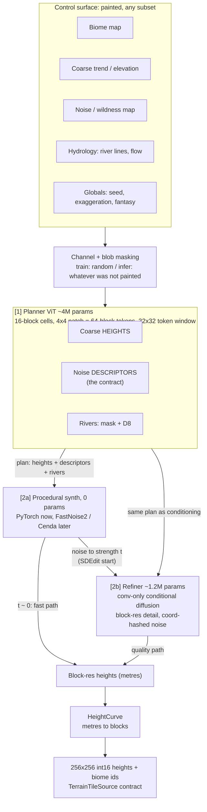
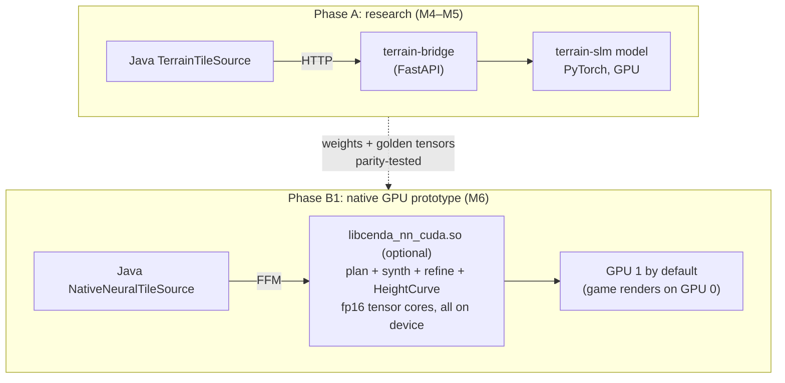

# Terrain SLM: Plan

> **Moved 2026-09-27.** The model is now officially **DaedalusTGM-Exp**. It lives in
> `Models/DaedalusTGM-Exp/` (was `terrain-slm/`), and the bridge lives in `Models/terrain-bridge/`
> (was `terrain-bridge/`). This plan was in `Dev Working/docs/`. It is kept as the running log, so
> older sections still use the old paths. Current architecture: [`Architecture.md`](Architecture.md).

**Status (2026-09-29):** **v4 is the default generator** on branch `Project-Daedalus`. M0–M5 done,
M4's painted-map half and M8 partly done, **M6 (native) and M7 (distillation) left**: see the
status column in §9 and the full done / left list in [`Architecture.md` §15](Architecture.md). The
running log here stops at R1 (2026-09-27); v2–v4 are written up in `Architecture.md` §1a–§12a.
*(Originally: draft, 2026-09-26, research branch off `Project-Heracles`.)*
**Rev 2 (2026-09-26):** native inference is **GPU-first** (a CUDA prototype on this machine). See §8.
**Rev 3 (2026-09-26):** **GPU only.** The server runs locally on this machine, so the CPU path is
deferred indefinitely and off the roadmap. GEMMs use **cuBLASLt** (decided).
**Active work:** §13, the rung-0 full-stack POC (2026-09-26). It replaces upstream in-game, and
we iterate from there.
**Hardware:** 2× RTX PRO 6000 (Blackwell, sm_120, 96 GB each, capped at 300 W). No NVLink.
**Diagrams:** Mermaid. To render them in IntelliJ's Markdown preview, enable
*Settings → Languages & Frameworks → Markdown → Markdown Extensions → Mermaid*.
Pre-rendered copies: `Terrain-SLM/pipeline.png`, `Terrain-SLM/deployment.png`. Re-render them
after editing a diagram.

---

## 0. Goal

Train a small terrain model of our own that looks **realistic but fantastical**:

- A small transformer (the "SLM") *plans* the terrain. It turns painted control maps into
  coarse heights, **procedural-noise parameter fields** and rivers.
- A small diffusion refiner adds learned detail at block resolution (heights).
- A noise synthesizer and the refiner share one interface (the descriptor contract), so there
  is a fast procedural path and a quality learned path.

This is primarily an ML learning and research project. It ships in-game only if it beats the
current stack on the axes below.

**Success means beating upstream (`xandergos/terrain-diffusion-30m`) on at least one of these
without losing badly on the others:**

| Axis | Upstream today | Target | Where we are (2026-09-29) |
|---|---|---|---|
| Game-scale drama | Earth-true, reads flat at 15 m/block | Dramatic, still plausible | ✅ Done: 256-tall world at 1:4, exaggerated height curve, long mountain ranges, sampled valleys (v2), hilly lowlands (v4) |
| Controllability | Coarse sketch + SNR | Painted biome / trend / noise / hydrology, any subset | ◐ Partly: every model conditions on any subset (presence flags), but the controls are procedural stand-ins; **painted maps: left** |
| Latency | 0.7–2.2 s/tile (GPU, Python service) | ≤10 ms/tile amortised on the native CUDA path (M6) | ◐ Partly: 0.56 s/tile streaming, 7.8 s cold (Python + Triton kernels); ≤10 ms needs M7 + M6 |
| Water | Carved afterwards (`ck_carve_water`) | Rivers are a model output that shapes the valleys | ✅ Done: routed drainage over the model's height, rivers condition the detail sampler, downhill-only (v4); no lakes yet |
| Deployment | 2 Python services, ~7 GB venv, WorldClim stdin trap | Optional native CUDA `.so`, no Python at runtime (M6) | ◐ Partly: one service (TGMPipe), no WorldClim at runtime, the game installs and warms it on launch; still Python at runtime (M6 left) |

Beating upstream on raw realism is **not** a goal. Its author ran autoguidance and KID sweeps
on a ~280M-parameter stack.

---

## 1. Hard constraints (what the game requires)

1. **Tile contract:** `TerrainTileSource.getTile(x, z)` → `TerrainTile` → bridge
   `/generate_heightmap` = 256×256 int16 block heights + 256×256 int16 biome ids. Phase A plugs
   in behind the bridge with **no Java changes**.
2. **Deterministic per seed, random access:** any chunk, in any order, gives the same bytes.
   Seams must not depend on request order or request shape (see `terrain-bridge/bridge/coarse.py`
   on upstream's ~1 m request-shape drift, which is why every request uses one canonical shape).
3. **Server-authoritative:** world gen runs on the server, which **currently runs locally on this
   machine** (2× RTX PRO 6000). A GPU requirement is therefore acceptable, and the CPU path is
   deferred (§8). Revisit only if a GPU-less server ever becomes a real target.
4. **Metres in, blocks out through one curve:** the model works in metres. The bridge's
   `HeightCurve` (`bridge/height_mapping.py`) stays the only metres→blocks mapping. When
   inference goes native (M6), that curve must be ported with a parity test, not re-derived.
5. **World limits:** `WORLD_HEIGHT` 1024, sea level 320 (Heracles).

---

## 2. Architecture overview

Heights are **split by frequency**:

- Low frequencies are *determined* by the controls, so they use supervised regression.
- High frequencies are *stochastic*, so they use generative models (noise or diffusion).



**The `t` dial:** the refiner starts from the procedural result noised to strength `t` instead
of from pure noise. `t≈0` is pure procedural (fast, obeys the knobs exactly, most fantastical).
`t≈0.3–0.5` keeps the procedural structure and adds realistic erosion. `t=1` generates the detail
from scratch.

### Deployment phases



---

## 3. Components

### 3.1 Controls and masking (any-subset conditioning)

Inputs at 16-block resolution (matching what `coarse.py` already serves):

| Channel | Training source | In-game source |
|---|---|---|
| Biome id → learned embedding | upstream `_classify_biome` on WorldClim (same ids the game already uses) | painted (indexed PNG) |
| Coarse trend | blurred + quantised DEM | painted (16-bit grey) |
| Noise / wildness | derived roughness + seeded noise channel | painted or procedural |
| Hydrology: river mask, log flow accumulation | `terrain-bridge/hydrology` (`flow.py`, `fill.py`, `basins.py`) on the DEM | painted lines |
| Globals (seed, exaggeration, fantasy) | randomised | sliders |

Each channel carries a **presence mask**. During training, channels are dropped whole or in
spatial blobs, and the model predicts everything. At inference, anything not painted is filled
in: paint a river and the model shapes its valley; paint none and it proposes rivers. This is
the MaskGIT-style mechanism, and it is where the "SLM" behaviour lives.

**Painting robustness:** training controls go through a degradation pipeline (quantisation,
blob rasterisation, dilation/erosion, line-width jitter) so real hand-painted input is not
out of distribution.

### 3.2 Planner

| | |
|---|---|
| Backbone | ViT: d=256, **5 layers**, 4 heads, MLP 4×, **2D RoPE** (window-size invariant), adaLN for globals |
| Tokens | 16-block cells, 4×4 patchify ⇒ 64-block tokens; training window 32×32 tokens = 2048 blocks |
| Head | DiT-style linear unpatchify back to 16-block cells |
| Params | ~4M |
| Outputs per 16-block cell (~25 ch) | coarse height (metres), descriptor vector (§3.3), river logit + D8 (9 classes) |
| Tiling | fixed world-lattice windows with 50 % overlap. **Blend the parameter fields** (safe because they are smooth). **Do not blend D8.** D8 comes from the owning window's centre region |

### 3.3 Descriptor contract

Everything downstream reads this, and the paint/override tools write it. Version it.

| Descriptor | Meaning | Target derivation from DEM (analytic, no fitting) |
|---|---|---|
| `amp[0..7]` | log amplitude per octave (~2–512 block wavelengths) | Laplacian-pyramid band energy per cell |
| `ridge` | ridged vs billowed blend | skewness of the high-pass band |
| `warp` | domain-warp strength | mean curvature variance / feature-line tortuosity (to validate in M3) |
| `aniso_c, aniso_s, aniso_k` | cos 2θ, sin 2θ, strength (range orientation) | structure tensor |
| `erosion` | derivative-damping strength | correlation of fine-band energy vs slope |

**Round-trip rule (M3 exit criterion):** `extract(synth(d)) ≈ d`. If the extractor cannot recover
what the synth was given, the targets are meaningless.

Because the targets are **statistics**, the game-side noise only needs **statistical parity**
with the training synth (a one-time per-octave gain calibration against FastNoise2), not
bit-parity.

### 3.4 Procedural synth (0 params)

Differentiable PyTorch implementation: multi-octave gradient noise with per-cell parameters
bilinearly upsampled; ridge blend; domain warp; anisotropic frequency scaling; derivative-damped
fBm (the erosion term, which damps fine octaves on steep slopes); river-mask valley carving
(lowers the trend, suppresses roughness near channels). Written against a spec so that Cenda
FastNoise2 nodes can reproduce it statistically.

### 3.5 Refiner

| | |
|---|---|
| Type | conditional diffusion, EDM or flow matching, **convolution-only** (no attention) |
| Size | ~32→64→96 channels, 2 levels, ~1.2M params |
| Receptive field | **kept small on purpose (~40 px)**: global structure comes from the planner, so the refiner only needs local context. That also keeps tiling halos and native compute cheap |
| Conditioning | upsampled coarse heights, descriptors, river mask, coordinate-hashed noise |
| Training | **fully paired**: (downsample(DEM), descriptors(DEM)) → DEM. Standard denoising loss; descriptor dropout for CFG |
| Inference | SDEdit from the procedural base at strength `t` |
| Steps | v0: 8–16 steps in cached 1024² regions (also the M6 native prototype). M7: distilled to 1–2 steps |
| Seams | a bounded receptive field makes each pixel depend only on inputs within `steps × RF`. Canonical region shapes + halo ⇒ identical bytes regardless of which request computed them |

### 3.6 Rivers

The planner predicts river presence + D8. In Phase A the synth carves valleys along the mask.
Wiring the predictions into `river_plan.hpp` (as cost bias / source hints) and replacing
`ck_carve_water`'s noise-derived channels is a **later** milestone. For v0 they are an
auxiliary output that gets evaluated but is not authoritative.

---

## 4. Data pipeline

- **DEM:** Copernicus GLO-30 (the upstream model's training set; public AWS Open Data bucket
  `copernicus-dem-30m`, or upstream `util_scripts/download_dem.sh`).
- **v0 scope (proposed):** regional subset. Alps, Rockies, Andes, Himalaya/Karakoram, Norway
  fjords, NZ Southern Alps, plus a few coastal lowland and river-delta regions so rivers and
  flats are represented. Roughly 300–500 1° tiles, ~10–15 GB raw.
- **Climate / biome:** WorldClim 2.1 bio rasters → upstream `_classify_biome` → game biome ids.
- **Hydrology:** `terrain-bridge/hydrology` fill + flow on each patch → river mask, log flow
  accumulation, D8.
- **Shards:** HDF5 or zarr per region: `dem`, `trend16`, `desc16`, `hydro16`, `biome16`,
  plus split ids (spatially disjoint train/val/test blocks, never random pixels).
- **Storage:** data and checkpoints on a separate data disk, never in git.

---

## 5. Training

| Stage | Loss | Notes |
|---|---|---|
| Planner v0 | L1 on heights + gradient loss; weighted L1 on descriptors; CE on D8; Dice on river mask | masking curriculum: low drop rate first, then high |
| Planner v0.5 | + end-to-end through the differentiable synth: spectral (per-band log power) + soft slope-histogram loss | verifies the whole chain, not only the descriptors |
| Refiner v0 | EDM / flow-matching denoising, CFG dropout on descriptors | paired, no GAN |
| Refiner M7 | consistency / shortcut distillation to 1–2 steps (QAT int8 only if needed) | faster native inference |
| Research (M8) | quantise descriptors into tokens, MaskGIT sampling with seeded RNG | fixes regression-to-mean blandness, gives sampling diversity |

**Hardware split:** GPU0 trains, GPU1 runs data prep, eval and sweeps. At 5M parameters, DDP is
unnecessary; use the second card to run sweeps in parallel. Expect hours per planner run.
Data prep is the long pole.

---

## 6. Evaluation harness (build before trusting any model)

| Metric | What it catches |
|---|---|
| KID on shaded relief (vs held-out DEM) | overall realism |
| Radially averaged power-spectrum slope | wrong roughness / missing bands |
| Slope + curvature histograms (per biome) | too smooth / too spiky |
| Drainage: fraction of cells draining to sea/basin, river sinuosity | fake-looking hydrology |
| Seam error: same pixel from different canonical requests | determinism bugs |
| Control adherence: painted vs produced (trend L1, biome-conditioned stats, river IoU) | does it listen to the paint |
| ms/tile (Phase A PyTorch vs Phase B1 CUDA) | shippability |

Baselines for every report: **upstream 30m**, **pure procedural (t=0) with hand-set
descriptors**, and **ours**, at the same coordinates / painted maps. Side-by-side shaded-relief
sheets are produced automatically.

---

## 7. Integration

- **Phase A (research):** the model runs inside, or next to, `terrain-bridge` and serves
  `/generate_heightmap` unchanged. A/B is a config switch. The `TerrainServiceProcessManager`
  launch argv gains a model selector.
- **Phase B1 (native GPU prototype, M6):** a new `NativeNeuralTileSource` calls
  `libcenda_nn_cuda.so` over FFM, with no Python services. `HeightCurve` gets ported (as a device
  LUT) with a parity test (§1.4).
  - **Graceful absence, loudly reported:** if the lib, the CUDA driver or a GPU is missing, or the
    ABI handshake fails, fall back to the Phase A bridge. Log a `[cenda-nn] WARNING:` line that
    matches the existing `[cenda] WARNING:` convention, because a silent fallback is the known trap
    here.
  - **Device selection:** `-Dcenda.nn.device=<n>` / `CENDA_NN_DEVICE`, **default 1 on this
    machine** so inference never competes with rendering on GPU 0. Single-GPU machines run it on a
    low-priority CUDA stream.
- Backend selection: `-Dstonebreak.terrainNN.backend=cuda|bridge` (default `cuda`, falling back
  to `bridge`).
- The existing `NativeWaterTiles` choke point stays in place until rivers become authoritative.

---

## 8. Native inference: GPU only (rev 3)

**Decision (2026-09-26): prototype the native kernels in CUDA first.** Why:

- **Iteration speed.** The machine has CUDA 13.4 (`/opt/cuda`), 2× sm_120 and CMake 4.4. Nsight
  Compute/Systems give per-kernel profiling that the CPU path has no equivalent for.
- **The undistilled refiner already runs fast enough.** On GPU, 8–16 sampling steps fit the
  budget, so native integration **no longer waits on distillation**. M6 (native) comes before
  M7 (distillation).
- **Learning value.** Tensor-core matmul/conv, fused attention and on-device sampling loops are
  the same skills llama.cpp's and stable-diffusion.cpp's CUDA backends use.
- **Weights stay in cache anyway.** ~5M params in fp16 ≈ 10 MB, which fits entirely in the L2
  cache of Blackwell workstation cards. Work is compute- and launch-bound, not bandwidth-bound,
  so fusion and a low kernel count matter most.

**The CPU path is deferred (rev 3).** The server runs locally on this GPU machine (§1.3), so no
milestone depends on it.

### Options considered

| Option | Verdict |
|---|---|
| **CUDA in Cenda (cuBLASLt GEMMs + hand-written kernels, separate optional lib)** | **chosen**: fastest to prototype on this box, best tooling; NVIDIA-only is fine because the server runs here |
| Triton / PyTorch custom ops | good for exploring kernel ideas inside Python, but it is not an artefact the Java game can load |
| Vulkan compute | portable to AMD/Intel; worth revisiting after B1 if GPU inference should ship to players |
| GLSL compute via CEARL in the game's GL context | client-only; competes with the render frame; possible later for previews/LOD |
| ONNX Runtime / TensorRT | quick native numbers, but heavy dependencies and little learning value; kept as a speed reference |
| CPU int8 in `libcenda_kernels.so` | **deferred**: only needed for a GPU-less server |

### B1 build layout

- `openmason-engine/cenda/native/nn_cuda/`: its **own CMake target** and **own shared lib**
  (`libcenda_nn_cuda.so`) with `CMAKE_CUDA_ARCHITECTURES=120`. Keeping it separate means
  `libcenda_kernels.so` still builds on machines without a CUDA toolkit, and `build-kernels.sh`
  treats a missing `nvcc` as a warning (the script must never fail the launch).
- Host code is C++20 in the CUDA target unless `nvcc` 13.4 accepts `-std=c++23`; the C ABI header
  stays plain C, like `kernels.h`.
- **Dependencies: CUDA runtime + cuBLASLt** (both from the toolkit at `/opt/cuda`). No cuDNN
  (~1 GB). **GEMMs go through cuBLASLt (decided, rev 3)**; everything cuBLASLt can't express
  (conv, attention, adaLN, RoPE, synth, sampler) is hand-written. Swapping a GEMM for a hand-written
  `mma.sync` kernel later is an optional learning exercise under the parity harness, not a
  milestone.
- C ABI in `include/cenda/nn.h`: `cnn_abi_version`, `cnn_create(weights_path, device)`,
  `cnn_plan_region(...)`, `cnn_generate_region(...)` (plan → synth → refine → HeightCurve → int16
  tile set; **one host copy out**), `cnn_destroy`.

### B1 kernel inventory

| Kernel | Notes |
|---|---|
| Patch embed + unpatchify | small GEMMs |
| GEMM (QKV, proj, MLP) | **cuBLASLt**, fp16 in / fp32 compute. Use its **bias(+GELU/ReLU) epilogues** where they fit. One matmul descriptor + **pinned algorithm** per shape, chosen once at `cnn_create` (from the heuristic, cached with the weights) so the kernel choice never drifts between runs |
| Fused attention | 1024 tokens × 4 heads × d64: a single-pass flash-style kernel is simple at this size |
| 2D RoPE, adaLN modulate, residual | small hand-written fused kernels (outside what cuBLASLt epilogues can express) |
| **Implicit-GEMM 3×3 conv** | the refiner hot path, with bias + activation + residual fused in the epilogue |
| Downsample / upsample / skip concat | fused into the adjacent convs' load stage |
| Coordinate-hash noise | integer hash + integer Gaussianisation (design rule 5) |
| Procedural synth | gradient noise + ridge + warp + erosion damping on device, so the whole chain stays on the GPU |
| Sampler loop | fixed σ schedule; the `t` dial picks the start step; the whole loop captured in a **CUDA Graph** to kill launch overhead |
| HeightCurve LUT + int16 pack | final epilogue |

### Rough compute budget (order of magnitude; M6 exit criterion is measuring it)

- **Planner:** ~13 GFLOP per 2048² window (×~4 with overlap). **Well under 1 ms of GPU time**;
  launch overhead dominates, so fuse it and use a CUDA Graph.
- **Refiner:** ~0.2 MFLOP / px / step, batched per 1024² region (+halo) ⇒ ~0.3 TFLOP per step
  per region. Assuming a first hand-written kernel reaches only 10–20 % of the card's tensor-core
  peak at 300 W (tens of TFLOP/s), that is **~10–30 ms per step per region**: ~0.1–0.5 s for 16
  undistilled steps (**~5–30 ms/tile**), and ~1–3 ms/tile after M7 distillation.

### Design-for-kernel rules (adopt in the Python model from day one)

1. Refiner is **convolution-only**, 3×3 kernels, small receptive field, **no GroupNorm** (use
   EDM2 magnitude-preserving, norm-free layers; upstream already has
   `terrain_diffusion/models/mp_layers.py`) or norms folded at export.
2. **Channel counts are multiples of 16** (tensor-core tiles), and activations stay in
   fp16-safe ranges (magnitude-preserving layers help here too).
3. Activations are LUT-friendly (SiLU via a table, or ReLU).
4. **Fixed** step count and sigma schedule, baked into the kernel.
5. **Coordinate-hashed noise with a spec'd integer hash** (PCG/xxhash of `seed, x, z, step`)
   and **integer-only Gaussianisation** (inverse-CDF LUT or summed uniforms), **no libm**. The
   worm carver already lost bit-identity to libm trig (see `CPlusPlusHelp.MD`); don't repeat it.
6. Fixed planner window, patch size, region shape and precomputed RoPE tables.
7. **Determinism on GPU:** hand-written kernels use no atomics and a fixed tile order. For
   cuBLASLt, **pin the algorithm per shape** and restrict the preference's reduction scheme to
   non-atomic variants (no atomics-based split-K). Result: identical output run to run on the same
   GPU + driver + toolkit, which is all a locally hosted server needs.
8. **int8 is optional (M7):** only if profiling says the fp16 path is too slow. Per-channel int8
   weights, int32 accumulation, fixed-point requantisation.
9. Weight file: flat versioned binary (header + named tensors), GGUF-like. Pull in GGUF itself
   only if we adopt ggml.

### Parity testing

- PyTorch exports **golden tensors** per layer and end to end: fp32 reference, plus (from M7)
  an exact int-simulation reference if int8 is adopted.
- **Python harness calls the C ABI through `ctypes` with host buffers**, not a torch CUDA
  extension. That avoids coupling to torch's CUDA version (the venv wheels are cu128, the system
  `nvcc` is 13.4) and exercises exactly what Java will call.
- ctest `nn_cuda_parity` (skips cleanly with no GPU): fp16 path within tolerance of fp32 per
  layer; run-to-run determinism; seam test across two regions; `t`-dial endpoints (`t=0` must
  equal the synth output exactly).
- A Java FFM contract test (like `CendaKernelsTest`), skipped when the lib/GPU is absent.
- Its **own ABI handshake** (`cnn_abi_version` ↔ Java `EXPECTED_NN_ABI`), independent of
  `ck_abi_version`, so a CUDA-lib bump never disables the chunk kernels.

---

## 9. Milestones

| # | Milestone | Exit criteria | Status (2026-09-29) |
|---|---|---|---|
| M0 | Branch + `terrain-slm/` Python project (uv, py3.12, torch cu128, same recipe as the spike) | env builds, `pytest` green, data dirs on the data disk | ✅ **Done.** `Models/DaedalusTGM-Exp/` on `Project-Daedalus`; pytest 178 pass; data on the data disk (`data` pointer file) |
| M1 | Data pipeline: GLO-30 subset → shards (dem, trend, desc, hydro, biome) | descriptor extractor unit-tested on synthetic noise with known params; visualiser sheet | ✅ **Done.** 24 regions / 333 tiles (v4), precipitation-weighted drainage, water masks, biome labels |
| M2 | Eval harness + baselines (upstream, procedural) | metric report for upstream at N fixed coords | ✅ **Done.** `eval/sheet.py`, `eval/mountains.py`, `eval/world_report.py`; upstream baseline in the POC reports (upstream itself removed 2026-09-27) |
| M3 | Differentiable synth + calibration | **round-trip** `extract(synth(d)) ≈ d` within threshold; FastNoise2 per-octave gains measured | ✅ **Done.** Round-trip gate green (`test_synth_roundtrip.py`). FastNoise2 gains dropped: the synth uses its own coordinate-hashed noise |
| M4 | Planner v0 + synth behind the bridge | **first playable world**: from a painted map and fully automatic | ◐ **Partly.** Fully automatic worlds since the POC (planner now R2, 4.83M; served by TGMPipe, the bridge is gone). **From a painted map: left** — no painted-map input yet |
| M5 | Refiner v0 (8–16 steps) + `t` dial, region generation | beats synth-only on KID + spectrum without losing control adherence | ✅ **Done, then superseded.** The refiner shipped in v1–v3; v4's 49M detail sampler replaced synth + refiner for heights |
| **M6** | **CUDA native prototype**: `libcenda_nn_cuda.so` (planner, synth, undistilled refiner, HeightCurve) + Java `NativeNeuralTileSource` with bridge fallback | per-layer + end-to-end parity vs PyTorch; seam + determinism tests; Nsight profile; **≤10 ms/tile amortised**; zero Python at runtime | ☐ **Left.** Scope is out of date: v4 runs a detail UNet, relief sampler, routed drainage, river pipeline and biome / bank nets, not planner + synth + refiner — re-plan first. Interim (2026-09-29): Triton kernels on the Python path (1.7× per tile, `Architecture.md` §12a) and a game-launch auto-setup, so players never install Python by hand |
| M7 | Distil to 1–2 steps into the CUDA path; int8 only if profiling asks for it | distilled within tolerance of teacher; ~1–3 ms/tile | ☐ **Left — the biggest speed lever.** The detail sampler is ~84% of a tile at 16 steps. Pair it with the detail-stability training run. Low precision: plain FP8 changes the sample (28–42 m RMS), so only with quantisation-aware training |
| M8 | (research) tokenised descriptors + MaskGIT sampling; rivers into `river_plan.hpp` | diversity metric up, adherence held | ◐ **Partly.** MaskGIT descriptors built (v3, `models/descgit.py`; texture 80–95% of real) but not used by v4. Rivers became a model output plus a Python river pipeline (v3/v4), not native `river_plan.hpp` |

**Done beyond the original milestones:** relief sampler (v2), hydrology sidecar, bank model and 3D river
planes (v3), TGMPipe replacing the bridge (2026-09-27), detail sampler, routed downhill-only rivers,
hilly lowlands and biome sidecar (v4), custom Triton kernels and the game-launch auto-setup (2026-09-29).

*Deferred, off the roadmap (rev 3):* a CPU inference path and a Vulkan port. Neither is needed
while the server runs locally on this GPU machine.

---

## 10. Risks

| Risk | Mitigation |
|---|---|
| Plain regression gives bland, averaged terrain | refiner adds stochastic detail; M8 token sampling |
| Fantasy overrides fall outside what the refiner saw, so it drags terrain back to realism at high `t` | that is the purpose of the `t` dial; measure it as a finding |
| Descriptor extractor ≠ synth (targets meaningless) | M3 round-trip gate before any training |
| 30 m data vs block scale (see §11) | decide scale up front; noise fills sub-data octaves |
| Painted input falls outside training distribution | degradation pipeline (§3.1) |
| NVIDIA-only (B1) | accepted: the server runs locally on this machine; bridge fallback remains |
| Inference competing with rendering | default to GPU 1 (game renders on GPU 0) |
| torch cu128 vs system nvcc 13.4 | never build torch CUDA extensions; parity goes through the C ABI via ctypes |
| Licensing (GLO-30 attribution, WorldClim, upstream MIT) | verify before shipping weights in-game; research use is fine |

---

## 11. Decisions

**Decided**

| Decision | Choice |
|---|---|
| Native inference target | CUDA on this machine (GPU only; CPU deferred) |
| GEMMs | cuBLASLt with pinned per-shape algorithms |

**Open**

| Decision | Recommendation | Status (2026-09-29) |
|---|---|---|
| Project location | tracked `terrain-slm/` sibling to `terrain-bridge/`; data/checkpoints gitignored on the data disk | ✅ Decided: `Models/DaedalusTGM-Exp/` (tracked; data on the data disk; shipped checkpoints tracked as bf16, no LFS) |
| Branch name | user's call | ✅ Decided: `Project-Daedalus` |
| Data scope v0 | regional subset (§4), global later | ✅ Decided for now: 24 regional subsets; global still later |
| **Horizontal scale** | **1 DEM px = 1 block at 30 m/block** + stronger vertical exaggeration. Keeps all learned detail backed by real data; features half as wide as today's 15 m/block | ✅ Decided differently: **60 m blocks** (2×2 DEM px), 256 tall, 1:4 scale |
| Painting tool | v0: PNGs with a documented channel/palette spec (Krita/GIMP). Later: Open Mason terrain-paint panel | ☐ **Open** — goes with painted-map input (M4's other half) |
| Refiner objective | flow matching (modern, simpler) vs EDM (matches upstream, has reference code). Lean flow matching | ✅ Decided: flow matching (refiner, relief and detail samplers) |

---

## 12. Proposed layout

```
terrain-slm/                 # tracked (code only)
├── pyproject.toml
├── terrain_slm/
│   ├── data/                # download, shard build, degradation, descriptors, hydrology glue
│   ├── synth/               # differentiable procedural synth (spec'd for FastNoise2 parity)
│   ├── models/              # planner ViT, refiner UNet (mp layers), heads
│   ├── train/               # planner / refiner / distill / QAT loops
│   ├── eval/                # metrics, baselines, relief sheets
│   ├── export/              # weight binary + golden tensors for Cenda
│   ├── native/              # ctypes wrapper over cenda nn.h (parity harness + eval backend)
│   └── serve/               # bridge adapter (Phase A)
├── configs/
└── tests/
openmason-engine/cenda/native/nn_cuda/          # Phase B1: libcenda_nn_cuda.so (own CMake target, sm_120)
├── include/cenda/nn.h                           #   C ABI + cnn_abi_version
├── src/*.cu                                     #   gemm, attention, conv, synth, sampler, curve
└── tests/                                       #   nn_cuda_parity (skips without GPU)
```

---

## 13. POC: rung-0 full stack (active, 2026-09-26)

**Goal:** the smallest version of **every** stage (planner, descriptors, synth, rivers, refiner),
served in place of upstream so the game generates worlds with it. We then iterate up the ladder
(R0 → R1 → R2 …, one change at a time, fixed data and eval; model growth is tried from R3 on).

### Units (the model works in native DEM pixels)

| Unit | Size | In blocks (bridge `scale=2`, 15 m/block) |
|---|---|---|
| native px | 30 m | 2 blocks |
| cell (planner/descriptor grid) | 8 px = 240 m | 16 blocks (matches `coarse.py`) |
| token | 4×4 cells = 32 px | 64 blocks |
| R0 planner window | 16×16 tokens = 64×64 cells = 512 px (15.4 km) | 1024 blocks |

The game's horizontal scale is **unchanged**: the server upsamples ×`scale` exactly like
upstream's `_get_upsampled`, so the 30 m/block question stays open.

### Pieces

| Piece | R0 spec |
|---|---|
| Data | GLO-30 **Alps slice** (~32 1° tiles, ~1 GB, AWS `copernicus-dem-30m`); spatially held-out val tiles |
| Biome labels | upstream's rule-based `_classify_biome` (MIT, vendored with attribution) on WorldClim 10′ rasters already on disk → game biome ids |
| Hydrology | priority-flood fill + D8 flow accumulation on the cell grid → river mask + D8 |
| Descriptors v0 (per cell) | `amp[5]` (band std at λ = 2,4,8,16,32 px), `ridge` (high-pass skew), `aniso` (cos 2θ, sin 2θ, k). 9 channels; warp/erosion come in R1+ |
| Synth | differentiable torch gradient noise: per-octave amplitude, ridge blend, anisotropic stretch, river valley carve. **Round-trip gate** `extract(synth(d)) ≈ d` |
| Planner R0 | ViT d128 × 2 layers × 4 heads, 2D RoPE, zero-init residual outputs (identity init, so layers can be grown later), ~0.4M params. Inputs: biome embedding, degraded trend, river mask, presence masks. Outputs: coarse height, descriptors, river logit, D8 |
| Refiner R0 | flow-matching, conv-only UNet 16-32-48 ch (2 levels), ~0.2M params, 128 px crops; predicts the residual over the upsampled coarse height; 8 Euler steps; SDEdit from synth at `t` |
| Controls in-game | **procedural "paint"**: seeded fBm continents trend + climate fields (lapse-rate temperature) → the same classifier → biome. Painted PNGs replace these later |
| Tiling | planner windows and refiner regions on a fixed world lattice with overlap. Every tile/region is computed in a **canonical shape** and blended deterministically, so output never depends on request order or shape |
| Server | `terrain_slm.serve.upstream_api`: upstream's contract (`/health`, `/terrain?i1&j1&i2&j2&scale&noise[&elev_only]` → int16 metres + int16 biome, `X-Height/X-Width/X-Dtype`) and the **same CLI flags** Java already passes |

### Integration (the swap)

- Java `TerrainServiceProcessManager`: new `-Dstonebreak.terrainService.backend=upstream|slm`.
  `slm` switches the default python exe / repo dir / module / model to `terrain-slm`. A
  `...module` property overrides the module name (the only thing hardcoded today, including the
  port-reclaim match).
- Bridge: `TERRAIN_BRIDGE_UPSTREAM_ID` joins the tile-cache fingerprint. **Without it the bridge
  would serve cached upstream tiles for the same seed.** Java sets it from the model id.
- New worlds only. Existing worlds keep their saved chunks, and new chunks would come from a
  different generator.

### Exit criteria

1. Descriptor round-trip test green; hydrology + classifier unit tests green.
2. Eval sheet on held-out tiles: real vs planner-coarse vs synth vs refined, shaded relief + spectra.
3. A new world generates in-game on `backend=slm`, with seams checked at region boundaries.
4. ms/tile measured (PyTorch, GPU 1).

### POC status (2026-09-26, end of day)

- **Built and verified:** data (Alps slice, 40 tiles), descriptors + synth (round-trip gate green,
  region-exact to 1e-4 m), planner R0 + wildness input (0.45M, 6.4 min), refiner R0 (0.34M, 8.7 min),
  world generator, upstream-compatible server, Java `backend=slm` + bridge `TERRAIN_BRIDGE_UPSTREAM_ID`.
  First in-game world generated (`slm-poc-a`, seed 42).
- **Held-out eval (t=0.6):** spectrum slope −4.13 vs real −4.15; slope-histogram L1 0.22
  (refiner alone given real descriptors: 0.06, so the planner is the bottleneck). Reports in
  `terrain-slm/reports/`.
- **Lessons baked in:** (1) regression planner outputs the conditional mean, so band 4 (1–2 km)
  must be synthesised, not carried by the coarse field; (2) roughness needs its own control
  (wildness), or the planner averages it; (3) sharp FFT bands and fixed spatial kernels, not DoG /
  per-region FFT.
- **Load time:** ~3.3 min to PLAYING, dominated by the bridge's river-planner coarse chunks
  (129 × 1024² native `elev_only` fetches through the full synth + refiner path). The cheap fix is
  to answer coarse/`elev_only` fetches from the planner cells + synth (open question: how much the
  refined tiles may differ from them).
- **Next rungs:** R1 planner (~1.5M) first; then the coarse fast path; then painted-map input.

### Rivers from the model (2026-09-26, later)

- **Decided:** rivers only (no lakes on `backend=slm` for now), R0 size.
- Planner: D8 head replaced by a log flow-accumulation head trained on the **3×3-dilated** field
  (on the 1-cell D8 lines the regression never reached the river threshold: IoU 0.0 → 0.325).
- `terrain_slm/world/rivers.py`: pixel-level ridge lines of the smoothed flow field → channels
  of flow-dependent width → water surface follows the channel's own ground (sloped = flowing),
  2 px levees, fixed-point no-spill rule. Local and request-independent (tested).
- River density knob `river_log_threshold` = 3.3 (training definition 6.08): on smooth
  procedural controls the planner under-predicts drainage magnitude ~10× but its ridge lines are
  right. Calibrated to the Alps' ~3% river-cell density.
- Wire: `/terrain?...&water=1` adds a water-surface plane; bridge `TERRAIN_BRIDGE_WATER_SOURCE=upstream`
  (`UpstreamWater`); Java `modelSuppliesWater()` skips NativeWaterTiles/BasinCache/CoarseDem.
- Measured in-game (seed 1234): **0 coarse-elevation requests**, 50 tiles all with water planes,
  ~1.6% river columns; load ≈ 15 s to PLAYING (was ~3.3 min).
- Known gaps: straight runs left over from the patch grid, dashed stretches where channels cross
  bumps, no lakes, no flow-direction octants for the water sim (the bridge path never had them).

### SLM is the default generator (2026-09-26)

Per user: no generator selector; the diffusion entry is replaced outright.
`TerrainServiceProcessManager.DEFAULT_BACKEND = "slm"`: every world (new or loaded) generates
with terrain-slm. `-Dstonebreak.terrainService.backend=upstream` survives only as a developer escape
hatch; the upstream code path (NativeWaterTiles/BasinCache/CoarseDem, spike venv) is untouched.
Worlds created on the diffusion model will get slm terrain for any chunks not yet saved (seams at
the explored boundary).

### 256-tall world at 1:4 scale (2026-09-26)

- `WorldConfiguration`: WORLD_HEIGHT 1024 → 256, SEA_LEVEL 320 → 64 (main's values).
- `TerrainScale` (game): 1:4 of the diffusion-era mapping on both axes — 60 m blocks
  (`downscale=2` from the 30 m model) and curve rates ×4 (48/16/40/96 m per block). 0 m → y 64,
  600 m → 100, 2000 m → 152, 4800 m → ~182. Passed as TERRAIN_BRIDGE_* env to bridge AND model server.
- Bridge: `downscale` config + param + cache namespace. Server: `downscale` path averages 2×2 px,
  settles water at block resolution against the bridge's own curve (≥1 water block per river
  column; dry neighbours raised to the water level).
- Depth-tuned generator constants restored to main's 256 values (caverns, mega caverns, worms,
  ravines, sinkholes, cave water table, iron curve, cheese threshold knots); caves back to
  12.4% volume / 42% roomy. Engine: VoxelChunkCodec.CHUNK_H 1024 → 256 (was throwing on every
  chunk send; `ChunkHeightContractTest` now pins it), clouds 768 → 192. Native Cenda mesher
  auto-re-enabled (its kernel is 256-tall).
- Tests: 3373 / 3298 pass / same 68 pre-existing failures as the 1024 baseline, nothing new.
  systems.map: registered 5 previously unmapped tests so the harness runs on this branch.
- **1024-tall worlds from before this change cannot be opened** (chunk storage is height-sized).

### More data + R1 (2026-09-27)

- **Data:** 7 GLO-30 regions, 134 tiles (`glo30.REGIONS`): alps, colorado_plateau, sahara_erg,
  borneo, great_plains, norway, east_africa; one held-out val tile each. Drainage target is
  **precipitation-weighted** (runoff proxy, "cells at 1000 mm"): borneo 5.5% river cells vs sahara 0.9%.
  Climate inputs via `planner.climate_input` (log precip) for the global range; WILD_NORM (1.77, 1.34).
- **Models:** R0 planner on all regions (0.44M, 14 min): val height 38.6 m, river IoU 0.22.
  **R1 planner (d176 x 4, 1.56M, 15 min): 34.5 m, IoU 0.30 -> default.** Refiner retrained on all
  regions (0.34M, 13.5 min, val 0.177). Refiner alone is excellent everywhere (dunes, fjords, volcanoes);
  planner remains the bottleneck -- great_plains comes out too rough on both sizes.
- **In-game climate:** blend of per-region **climate archetypes** (median land climate of each training
  region) with sharp softmax weights (zones ~1000 blocks). Independent per-variable noise had given only
  forest/taiga; the classifier's desert needs warm AND dry, jungle hot AND wet AND unseasonal.
  Result: desert 3-7%, jungle, savanna, forest, taiga, grove, swamp, ocean per world.
- Lesson: never run two trainers on one GPU without MPS -- time-slicing made the small-kernel
  planner 15x slower (340 vs 22 ms/step).
